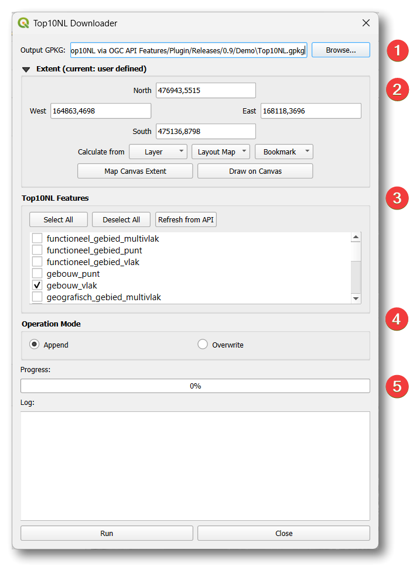
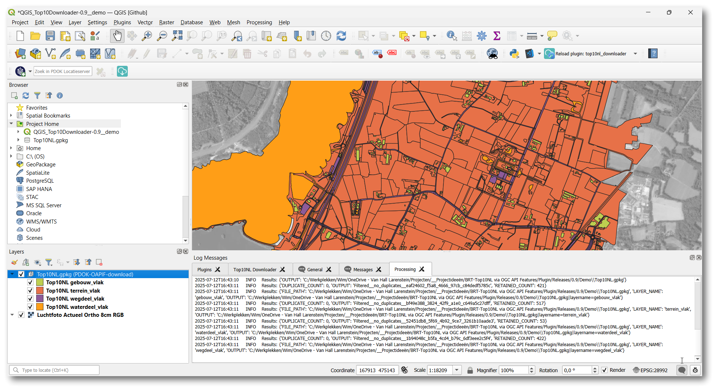

# Top10NL Downloader-plugin

Een QGIS plugin waarmee BRT-Top10NL-features kunnen worden gedownload vanaf de [PDOK-OGC API Features-service](https://api.pdok.nl/brt/top10nl/ogc/v1). De plugin maakt het mogelijk om een gebied in te stellen en de features op te slaan als geopackage layers. Met de *append*-optie kan een geopackage aangevuld worden met meer features. De plugin controleert op eerder gedownloade features en verwijdert deze.

Deze plugin is niet bedoeld om grote gebieden mee te downloaden. Wanneer grote gebieden nodig zijn, is het beter om de via de [BRT Top10NL Atom downloadservice](https://www.pdok.nl/atom-downloadservices/-/article/basisregistratie-topografie-brt-topnl) een geopackage van de Top10NL van heel Nederland te downloaden.

## Functionaliteiten

- Downloaden van BRT-Top10NL OAPIF-service bij de PDOK.
- Instellen van de geografsche uitsnede van het te downloaden gebied.
- Opslaan ban de features als Geopackage-layer
- Loggen van de timing van alle downloadoperaties.
- Optie om geopackage-layers te overschrijven of om features toe te voegen aan bestaande layers. 
- Wanneer features worden toegevoegd aan een bestaande layer worden dubbele features verwijderd.
- Layers kunnen meteen aan het QGIS-peoject worden toegevoegd

## Installatie

*Note: This method will be available once the plugin is published to the QGIS plugin repository.*

1. Open QGIS
2. Ga naar `Plugins` > `Manage and Install Plugins...`.
3. Selecteer de `All`-tab.
4. Zoek naar de "Top10NL Downloader".
5. Klik op de "Top10NL Downloader" in lijst met zoekresultaten.
6. Click the `Install Plugin` button.

## Plugin gebruiken

Na installatie is de plugin op twee manieren te benaderen:
- Via het `Plugins`-menu > `PDOK OGC API Features-downloaders` > `Tp10NL Downloader`.
- Via de `PDOK OGC API Features-downloaders` toolbar: het icoon van de `Top10NL Downloader` 

### Standaardwerkwijze.

1. **Open een QGIS project**:
   - Zorg ervoor dat het coördinaatstelsel van het QGIS-roject RD-New (EPSG:28992) is.
   - Zoom in naar het gebied dat je wilt downloaden. Een achtergrondkaart is daarbij behulpzaam. De kaartuitsnede waarop is ingezoomd, wordt ingesteld als de initiele uitsnede van het te downloaden gebied.

1. **Open het Top10NL Downloader-scherm**:
   - Klik op de het Top10NL Downloader-icoon in the toolbar of de menu-option vanuit het plugin-menu.

2. **Stel de parameters in**:
   - **Output-GPKG** (1): Kies de map waar het GeoPackage-bestand moet worden opgeslagen en geef het bestand een naam; of kies een bestaand geopackage-bestand. Een logfile met dezelfde naam wordt op dezelfde locatie opgeslagen.
     - Standaardnaam voor een nieuwe geopackage is `Top10.gpkg`. 
     - Standaardmapnaam is de map waar het project is opgeslagen: de `QGIS-project home`.
     - **Waarschuwing:** *Het operating system van je computer kan een waarschuwing geven dat een geopackage-bestand wordt overschreven. Echter, de geopackage wordt niet overschreven. Alleen layers in de geopackage kunnen worden overschreven of er kunnen features aan layers worden toegevoegd.*
   - **Gebiedsuitsnede** (2): Stel de gebiedsuitsnede in met de uitsnede-widget. De standaard-uitsnede komt overeen met de huidige kaartuitsnede. Op verschillende manieren kan het te downloaden gebied ingesteld worden:
     - Gebruik de huidige kaartuitsnede met de "From Canvas"-knop.
     - Teken een rechthoek op de kaart met de "Draw on canvas"-knop.
     - Typ zelf de coördinaten in.
     - Bereken de uitsnede vanuit een bestaande layer; kies een layer uit de lijst.
     - Bereken de uitsnede vanuit een bookmark; kies een bookmark uit de lijst.
     - Bereken de uitsnede vanuit een map op een print layout; kies een map op een print layout uit de lijst.
   - **Top10NL-Feature types** (3): Vink aan welke feature types gedownload moeten worden vanuit de Top10NL OAPIF-service. Enkele veelgebruikte feature types staan standaard aangevinkt:
     - *gebouw_vlak*
     - *terrein_vlak*
     - *wegdeel_vlak*
     - *waterdeel_vlak*
   - **Operation Mode** (4): Keuze: layer in de geopackage overschrijven of toevoegen aan een aanwezige layer. Standaardoptie is `Append`.
     - `Append`: Wanneer een layer met dezelfde naam als de Top10NL-feature type al aanwezig is in de geopackage dan worden gedownloade features toegevoegd aan deze layer. Eventuele aanwezige features met een gelijke unieke **ID** worden in een nabewerking ontdubbeld. 
     - `Overwrite`: Wanneer een layer met dezelfde naam als de Top10NL-feature type al aanwezig is in de geopackage, wordt deze layer overschreven. Alleen de layer wordt overschreven; niet de geopackage.

3. **Run het downloadproces**:
   - Klik op Run om het downloadproces te starten
   - De progress bar toont de voortgang van het downloadproces.
   - Het log-scherm toont informatie over het verwerkingsproces.

4. **Layers toevoegen aan de kaart**:
   - Nadat de download is afgerond verschijnt de vraag of de layers aan het QGIS-project moeten worden toegevoegd..
     - Kies je `Yes`, dan worden de layers aan je QGIS-project toegevoegd. De layers worden geplaatst in een group layer die de naam van de geopackage bevat. Layers worden niet toegevoegd wanneer ze al aanwezig zijn. Ze worden dan alleen ververst om eventuele wijzigingen aan de layers in kaart te tonen. 
     - Kies je `No`, dan worden de layers aan je QGIS-project toegevoegd. Eventueel al aanwezige layers worden ververst om eventuele wijzigingen aan de layers in kaart te tonen.
     - **Waarschuwing**: layers kunnen leeg zijn. Wanneer er geen features aanwezig zijn binnen de gebiedsuitsnede wordt een layer evengoed aangemaakt.
     - **Waarschuwing**: layer geografisch_gebied_punt is altijd leeg. Zie [deze discussie op het Geoforum](https://geoforum.nl/t/top10nl-feb-2022-geografisch-gebied-in-gpkg/6974/6).

5. **Logging**:
   - Het downloadproces wordt als volgt gelogd:
     - Het downloadproces wordt weggeschreven in een tekstbestand dat je terug kunt vinden in dezelfde locatie als de geopackage. Deze logging wordt ook in het pluginscherm getoond (5).
     - Het panel met de `QGIS-Log Messages` toont wat meer informatie:
       - Het **Processing**-tabblad toont de output van de processing tools die in de plugin worden aangeroepen. Kijk in dit tabblad om eventuele processing errors te bekijken.
       - Het **OAPIF**-tabblad wordt getoond wanneer er connectieproblemen optreden aangaande de OGC API Features-service.
       - Het  **Python**-tabblad wordt getoond wanneer er specifieke technische pythonproblemen optreden.

## Probleemoplossing en ondersteuning

- Raadpleeg de verschillende logs.
- Bugs, wensen, andere issues: registreer deze in de [issue tracker](https://github.com/wvdbee/top10_downloader/issues).

## Licentie

This program is free software; you can redistribute it and/or modify it under the terms of the GNU General Public License as published by the Free Software Foundation, version 3 of the License.

## Credits

Deze QGIS-plugin is gemaakt met ondersteuning van AI: Claude en CoPilot zijn ingezet als hulp.
Ik ben er bewust van dat AI gebruik maakt van het werk van andere mensen. Helaas ben ik niet in staat om eventuele referenties naar het werk van derden te achterhalen en, wanneer dat van toepassing is, eventuele credits aan deze personen te doen toekomen.

# Top10NL Downloader Plugin

A QGIS plugin for downloading Dutch BRT-Top10NL features via the OGC-API Feature service from the PDOK. It's main purpose is to extract feature types for a limited spatial extent. 

Do not use this plugin to download large area's. For that purpose use the [BRT Top10NL Atom downloadservice](https://www.pdok.nl/atom-downloadservices/-/article/basisregistratie-topografie-brt-topnl) instead. It will provide you with an up-to-date geopackage of Top10NL for the whole of The Netherlands.

## Features

- Download Top10NL features from the Dutch PDOK service via OGC-API Features
- Select features by type and geographic extent
- Save output as GeoPackage
- Log all download operations
- Options to overwrite layers or append to existing layers
- When features are appended tot a layer, duplicate features will be removed
- Direct layer loading into QGIS after download

## Installation

*Note: This method will be available once the plugin is published to the QGIS plugin repository.*

1. Open QGIS
2. Go to `Plugins` > `Manage and Install Plugins...`
3. Select the `All` tab
4. Search for "Top10NL Downloader"
5. Click on "Top10NL Downloader" in the results
6. Click the `Install Plugin` button

## Usage

After installation, you can access the plugin in two ways:
- From the `Plugins` menu > `PDOK OGC API Features-downloaders` > `Tp10NL Downloader`.
- From the `PDOK OGC API Features-downloaders` toolbar: the icon for `Top10NL Downloader` 

### Basic Workflow

1. **Open a QGIS project**:
   - Be sure that your QGIS project is in Dutch RD-New-projection (EPSG:28992).
   - Zoom in to the location that you want to download. The map extent will be the initial extent of area that would be downloaded.

1. **Open the Top10NL Downloader dialog**:
   - Click on the Top10NL Downloader icon in the toolbar or the menu option from the plugin-menu.

2. **Set parameters**:
   - **Output GPKG** (1): Choose where to save the GeoPackage file; a new file can be created or an existing geopackage file can be selected. A logfile will be created in the same location, with the same name as the geopackage file.
     - Default name is `Top10.gpkg`. 
     - Default location is the QGIS project home if available.
     - **Warning:** *Your operating system may give a overwrite-warning whenever you select an existing geopagkage. However, the geopackage will not be overwritten. Only the layers within the geopackage will be overwritten or appended to.*
   - **Extent** (2): Define the area to download using the interactive extent widget. The default extent is the current map extent. Change the download extent as prefered:
     - Use the current canvas extent with the "From Canvas" button.
     - You can draw directly on the map.
     - Enter coordinates manually in the widget.
     - Select the extent of an existing map layer.
     - Select the extent of a bookmark.
     - Select the extent of a map on a map layout.
   - **Top10NL Feature types** (3): Select the feature types to download from the Top10NL OAPIF-service. Some usefull feature types are enabled by default:
     - gebouw_vlak
     - terrein_vlak
     - wegdeel_vlak
     - waterdeel_vlak
   - **Operation Mode** (4): Choose to overwrite existing data or append to it. Default is `Append`.
     - `Append`: If a layer with the feature name is already available in the geopackage, features will be added to this layer. A post processing task will remove duplicate features, according to the **ID** of the features.
     - `Overwrite`: A layer with the feature name that is already available in the geopackage will be overwritten. Just the layer, not the geopackage.

3. **Run the download**:
   - Click the "Run" button to start the download process.
   - The progress bar will show the download progress.
   - The log window will display real-time information about the download process.

4. **Add layers to map**:
   - After the download is complete, you'll be asked if you want to add the downloaded layers to your map.
     - If you choose `Yes`, the layers will be added to your QGIS project. They will be placed in a group layer that contains the name of the geopackage.
     - If you chooose `No`, no layers will be added to your QGIS project. Already available layers in the project will be refreshed, to reflect any possible changes to the layer.
     - **Warning**: layers can be empty. If there are no features within the download exent, a new layer will be created anyway.
     - **Warning**: layer geografisch_gebied_punt is always empty. See: [this discussion on the Dutch Geoforum](https://geoforum.nl/t/top10nl-feb-2022-geografisch-gebied-in-gpkg/6974/6)

5. **Logging**:
   - The download process is logged as followed:
     - The download process is written down in a text file that you will find in the same locatin as the geopackage. This logging is shown in the plugin tool as well (5).
     - The QGIS-Log Messages panel provides some more information:
       - The **Processing** tab shows the output of the processing tools that are used in this plugin. Check this tab for processing errors.
       - The **OAPIF** tab will appear whenever there are connection issues regarding the OGC API Features-service.
       - The **Python** tab will appear whenever technical python issues occur.

## Troubleshooting, support

- Check the logs.
- For bugs, feature requests, and other issues, please submit them to the [issue tracker](https://github.com/wvdbee/top10_downloader/issues).

## License

This program is free software; you can redistribute it and/or modify it under the terms of the GNU General Public License as published by the Free Software Foundation, version 3 of the License.

## Credits

This QGIS-plugin had been made with the help of AI: both Claude and CoPilot.
I am aware that AI uses the works made by other people. Unfortunately I was not able to trace back any references to their works and give proper credits where credits are due.

